<!--
**ShadowySpirits/ShadowySpirits** is a ✨ _special_ ✨ repository because its `README.md` (this file) appears on your GitHub profile.

Here are some ideas to get you started:

- 🔭 I’m currently working on ...
- 🌱 I’m currently learning ...
- 👯 I’m looking to collaborate on ...
- 🤔 I’m looking for help with ...
- 💬 Ask me about ...
- 📫 How to reach me: ...
- 😄 Pronouns: ...
- ⚡ Fun fact: ...
-->
### Hi there 👋

<h2 align="left">My name is SSpirits and I'm a developer, currently learning Rust</h2>

###

  
  
  
  
  
  
  
  
  
  
  
  
  
  
  
  
  

###

  

###

    <picture>
        <source
          srcset="github-stats-dark.svg"
          media="(prefers-color-scheme: dark)"
        />
        <source
          srcset="github-stats-light.svg"
          media="(prefers-color-scheme: light), (prefers-color-scheme: no-preference)"
        />
        
      </picture>
  
  <picture>
    <source
      srcset="language-stats-dark.svg"
      media="(prefers-color-scheme: dark)"
    />
    <source
      srcset="language-stats-light.svg"
      media="(prefers-color-scheme: light), (prefers-color-scheme: no-preference)"
    />
    
  </picture>

###

 

    

###
